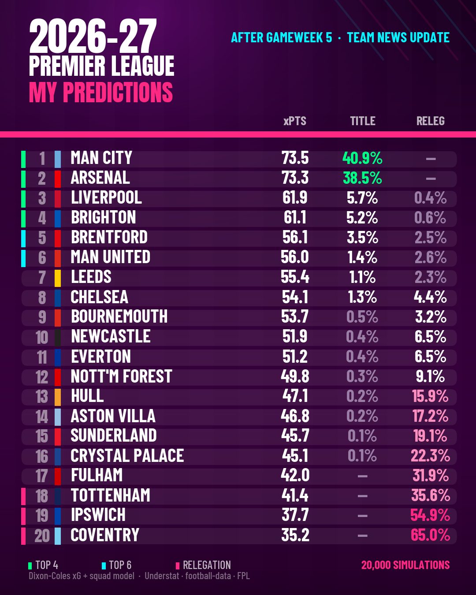

# Premier League Supercomputer

An expected-goals model that simulates the rest of the 2026/27 Premier League
season 20,000 times, refits itself twelve hours after every gameweek, grades its
own past predictions against the bookmakers, and emails the result.

Runs on GitHub Actions' free tier. Costs nothing.



---

## What it does

Every run, without anyone pressing anything:

1. Pulls the latest results, expected goals, squads and injuries
2. Refits club ratings on twelve seasons of data, weighted toward recent form
3. Adjusts for transfers, injuries, suspensions and managerial changes
4. Simulates every remaining fixture 20,000 times
5. Scores last week's predictions against what actually happened
6. Renders a graphic and emails it

## How the model works

**Club ratings.** A Dixon-Coles model gives every club an attack and a defence
rating, fitted on a 70/30 blend of non-penalty expected goals and actual goals
across twelve seasons, exponentially weighted with a 154-day half-life. Expected
goals are used because goals over 38 matches are noisy: a club can finish six
points from where its performances say it should be.

**Player values.** A regularised plus-minus model (RAPM) over 200,000
player-match records estimates what each club creates and concedes with each
player on the pitch, adjusted for teammates and opposition. This is what makes
transfers computable: a squad's rating is the minutes-weighted sum of its
players' values.

**Uncertainty.** Two sources, both required. Bootstrap resampling captures how
little we know about the ratings themselves. A drift term captures genuine
squad change over a summer — measured at 0.171 SD (attack) and 0.180 SD
(defence) across 170 team-seasons, decaying as real matches arrive.

Using only bootstrap gives 80% intervals that cover 55–70% of outcomes. Adding
the measured drift brings coverage to 77%. The number that fixes calibration is
the number the data says it should be.

**Simulation.** Each fixture gets a full Dixon-Coles scoreline grid. Scorelines
are sampled, not assumed, and real Premier League tiebreak rules are applied.

---

## Validation

Nothing ships without passing a backtest. Every result below is walk-forward:
the model is refitted using only data available at the time and never sees a
result before predicting it.

### Match level, held-out seasons

Four seasons never used for tuning:

| Season | Model RPS | Bookmaker RPS |
|---|---|---|
| 2019/20 | 0.19865 | 0.19871 |
| 2020/21 | 0.21363 | 0.21315 |
| 2021/22 | 0.19459 | 0.18897 |
| 2025/26 | 0.20804 | 0.20528 |
| **All (1,520 matches)** | **0.20373** | **0.20153** |

**Within 1.1% of the closing market**, on free data, with no team news.

### Season level, seven pre-season forecasts

Fitted the day before each season started, then simulated:

| Model | MAE (points) | Rank correlation |
|---|---|---|
| Naive baseline (last season's table) | 10.95 | 0.690 |
| Club ratings only | 9.389 | 0.758 |
| **+ squad layer** | **9.264** | **0.770** |
| **+ manager layer (shipped)** | **9.216** | **0.772** |

80% intervals cover 77% of outcomes. The eventual champion appeared in the
model's top three in all seven backtested seasons.

---

## What was tested and rejected

Three enhancements failed the same gate that the shipped ones passed. They are
switched off. The code is still in the repository so the results can be checked.

| Rejected | MAE | Rank corr | Why |
|---|---|---|---|
| Market odds blend | 9.322 | 0.753 | Marginal MAE gain, worse ranking and calibration |
| Manager effects, all changes | 9.311 | 0.760 | Worse on every metric |
| Manager values from foreign leagues | not built | — | Player conversion was already weak at n≈200; a dozen manager moves would be noise |
| Fixture congestion | not built | — | No measurable effect. See below |

**The manager failure is instructive.** Version one penalised Bournemouth for
hiring Iraola and Liverpool for hiring Slot — who then won the league. It could
not distinguish "this manager is worse" from "we have never seen this manager
before": both incoming managers had no Premier League record and were entered as
league average. Restricting the layer to moves where *both* managers have a
Premier League record flips the result, and that version ships.

---

## Findings worth reading

**Championship points do not predict Premier League performance.**
Across 33 promoted clubs since 2015, the correlation between Championship points
and first-season Premier League rating is **+0.043**. Norwich went up with 97
points and were the worst promoted side in the sample; Wolves went up with 99 and
were the best. A regression on Championship points performs no better than a flat
average, so all promoted clubs get the same prior with a deliberately wide error
bar.

**Foreign form travels poorly.**
Fitting the same plus-minus model in La Liga, Serie A, the Bundesliga and Ligue 1,
then comparing players who moved to England:

| League | Players who moved | Correlation | Variance explained |
|---|---|---|---|
| La Liga | 197 | 0.103 | 1.1% |
| Serie A | 180 | 0.205 | 4.2% |
| Bundesliga | 154 | 0.256 | 6.5% |
| Ligue 1 | 213 | 0.180 | 3.2% |

A player's output abroad explains under 7% of what they do in the Premier League.
The conversion correctly shrinks foreign values almost to league average.

**Fixture congestion does not measurably affect performance.**
1,488 FA Cup and EFL Cup ties involving Premier League clubs were scraped for
2014–2026, giving every league match a "days since this club's last match of any
kind" figure. Each club was then compared against its own season average, so
squad quality cannot contaminate the result:

| Measure | ≤3 days rest | ≥7 days rest | Difference | p |
|---|---|---|---|---|
| xG created | +0.022 | −0.004 | **+0.025** | 0.32 |
| xG conceded | −0.009 | +0.007 | **−0.015** | 0.53 |
| Points won | +0.061 | +0.003 | **+0.058** | 0.16 |

1,208 short-rest team-matches against 3,457 long-rest. Every sign points the
*opposite* way to the received wisdom: congested clubs created slightly more,
conceded slightly less and won slightly more. None of it significant, and the
largest effect is about a tenth the size of home advantage.

The most likely explanation is that clubs rotate. A 25-man squad exists for
exactly this, and the squad layer already sees who actually plays. So congestion
is not modelled, and the reason is measurement rather than laziness.

**A higher title chance does not require more expected points.**
Title probability lives in the far right tail, not the mean. A club with a wider
range of outcomes can have fewer expected points and a better chance of winning
the league. In the current table Brentford sit below Leeds on expected points but
above them on title probability, because their distribution is wider in both
directions.

---

## Limitations

Stated plainly, because a model that hides these is not worth reading.

- **Pre-season MAE is around 9 points per club.** No pre-season model is much
  better. Accuracy improves sharply once real results arrive.
- New signings from outside Europe's big five leagues are valued at league
  average.
- Manager changes where the incoming manager has no Premier League record are
  not scored at all.
- Guardiola's decade at City cannot be separated from City itself with any
  confidence; his successor's own record is used instead.
- No fixture congestion adjustment — tested across 12 seasons and 1,488 cup
  ties, no measurable effect found (see above).
- Home advantage is one league-wide value, not per club.
- The plus-minus model struggles to separate players who never rotate. Football
  has far less lineup variation than the sports these methods were built for.

---

## Running it yourself

```bash
pip install -r requirements.txt
FORCE_RUN=1 python src/update.py
```

Full run — refit, 20,000 simulations, render, email — takes about 40 seconds on
one CPU core.

For scheduled runs, set three repository secrets: `GMAIL_USER`,
`GMAIL_APP_PASSWORD` (a Google App Password, not your account password) and
`MAIL_TO`. The workflow polls every two hours and exits in seconds unless a
gameweek has settled.

### When it publishes

A gameweek publishes when every fixture in it has been played, twelve hours have
passed since the last one finished, and it has not already been published. A
round ending Monday evening publishes Tuesday morning; a midweek round ending
Wednesday publishes Thursday. **Five gameweeks this season end on a Wednesday**,
which a fixed weekly schedule would handle badly.

A match still unplayed five days after its scheduled kickoff is treated as
postponed so the round can settle without it.

---

## Documentation

[**HOW-IT-WORKS.md**](HOW-IT-WORKS.md) — a plain-English walkthrough of every
file, with worked examples and the bugs found along the way. No statistics
background needed.

## Layout

```
src/update.py         the weekly job
src/gate.py           decides when a gameweek has settled
src/ratings.py        Dixon-Coles fit and scoreline grids
src/simulate.py       bootstrap ensemble and Monte Carlo
src/rapm.py           plus-minus player values
src/eu_rapm.py        the same, for four other European leagues
src/squad_live.py     current squads, availability, minute allocation
src/managers.py       manager spells
src/manager_model.py  manager effects
src/render.py         graphics
src/mailer.py         email
src/cup_fixtures.py   FA Cup and EFL Cup dates, for the congestion test
src/backtest*.py      every validation run behind the numbers above
```

---

## Data

- [Understat](https://understat.com) — expected goals, player and match level
- [football-data.co.uk](https://www.football-data.co.uk) — results and closing odds
- [Fantasy Premier League API](https://fantasy.premierleague.com) — squads, injuries, suspensions
- Wikipedia — manager spells, domestic cup fixtures
- Fixtures via fixturedownload.com

Please respect these sources' terms and rate limits.

---

## A note on the graphics

No club crests or league logos are used — those are trademarked. Club identity is
shown with a colour bar only.
