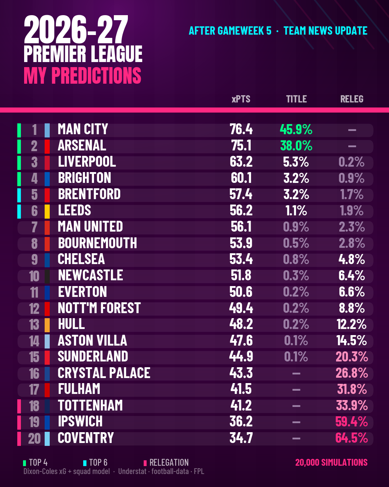

# Premier League Supercomputer

An expected-goals model that simulates the rest of the 2026/27 Premier League
season 20,000 times, refits itself three hours after every gameweek, predicts
every fixture in the next two rounds, forecasts Fantasy Premier League points for
every player, and grades its own past predictions against the bookmakers in
public.

**Live site: [shanbhag003.github.io/pl-supercomputer](https://shanbhag003.github.io/pl-supercomputer/)**

Runs on GitHub Actions' free tier. Costs nothing.



---

## What it does

Every run, without anyone pressing anything:

1. Pulls the latest results, expected goals, every shot and lineup, squads,
   injuries and betting odds
2. Refits club ratings on twelve seasons of data, weighted toward recent form,
   with each shot's xG adjusted for the score when it was taken
3. Adjusts for transfers, injuries, suspensions and managerial changes
4. Simulates every remaining fixture 20,000 times
5. Predicts result and scoreline for every fixture in the next two gameweeks
6. Predicts FPL points for every player over the next five gameweeks
7. Scores its own past predictions against the results and the bookmakers
8. Renders a graphic, rebuilds the site and emails it

## How the model works

**Club ratings.** A Dixon-Coles model gives every club an attack and a defence
rating, fitted on a 70/30 blend of non-penalty expected goals and actual goals
across twelve seasons, exponentially weighted with a 154-day half-life. Expected
goals are used because goals over 38 matches are noisy: a club can finish six
points from where its performances say it should be.

**Game-state adjusted xG.** A team two goals up sits deep; the team chasing gets
chances it would not get at 0-0. Every shot since 2014 is replayed with the
score at the time and rescaled to its level-state value, so a comfortable lead
does not make the leader look worse or the chaser better. Improved both match
predictions and title/relegation forecasts in walk-forward testing
([VALIDATION.md](VALIDATION.md) §13).

**Player values.** A regularised plus-minus model (RAPM) over every
player-match since 2014 estimates what each club creates and concedes with each
player on the pitch, adjusted for teammates and opposition. Each player is
shrunk toward what his own numbers suggest (xG, xA, involvement in build-up,
position) rather than toward league average, which separates players better
when the same eleven keep sharing the pitch. This is what makes transfers
computable: a squad's rating is the minutes-weighted sum of its players' values.

**Minutes.** Each club has a fixed budget of 38 x 11 x 90 minutes. Returning
players keep roughly last season's share; whatever departures freed up goes to
new signings in proportion to price. Nobody is allocated more than 90 minutes a
match. When a player is unavailable, his minutes pass to available players **in
the same position** with room to absorb them — a missing striker is covered by
the backup striker, not by a centre-back. Only if that position has no spare
capacity does the model look wider. This is what lets squad depth register:
Arsenal losing a forward barely moves them because two capable deputies exist,
while a club with one specialist in that role is hit much harder.

**Uncertainty.** Two sources, both required. Bootstrap resampling captures how
little we know about the ratings themselves. A drift term captures genuine
squad change over a summer — measured at 0.171 SD (attack) and 0.180 SD
(defence) across 170 team-seasons, decaying as real matches arrive.

Using only bootstrap gives 80% intervals that cover 55–70% of outcomes. Adding
the measured drift brings coverage to 77%. The number that fixes calibration is
the number the data says it should be. Mid-season the plain 10th–90th range
held only 72%, so the published "likely range" is the 7th–93rd percentile,
which held 80% across 640 backtest forecasts ([VALIDATION.md](VALIDATION.md) §12).

**Simulation.** Each fixture gets a full Dixon-Coles scoreline grid. Scorelines
are sampled, not assumed, and real Premier League tiebreak rules are applied.

**FPL expected points.** For every player and fixture: minutes from his recent
appearances and FPL's injury news; goals and assists from his share of his
team's chances times the model's predicted goals; clean sheets from the
opponent's predicted goals; saves, bonus and 2025/26 defensive-contribution
points. Next 1, 3 and 5 gameweeks, captain picks and points per £m on the site.
FPL's own expected points are logged before every deadline for an honest
comparison ([VALIDATION.md](VALIDATION.md) §18).

---

## Match predictions

Beyond the league table, every fixture in the next **two** gameweeks gets a
prediction: a result, a scoreline, and the probability of all three outcomes.

**Two rounds, not one.** If a scheduled run is missed, the following round has
already been predicted and stored, so it can still be scored honestly. Predicting
only the next round would leave a permanent hole in the record.

**Frozen at kickoff.** A prediction is rewritten on every run until its match
kicks off, so late team news is reflected. After kickoff it is never touched
again. This one rule is what makes the public scorecard mean anything: what gets
marked is what stood when the ball was kicked, not a tidied-up version. It also
prevents a run firing mid-match from inventing a prediction for a game already
in progress.

**Scorelines are conditional on the result.** Taking the single most likely cell
of the scoreline grid gives 1-1 surprisingly often, even when a home win is the
most likely outcome — which would print "home win, most likely 1-1". So the
outcome is chosen first, then the most likely scoreline *within* that outcome.

**Close calls are labelled, not overridden.** The prediction is always the most
likely of home/draw/away. In a Dixon-Coles grid the draw is almost never the
largest of the three, so the model essentially never predicts one. An earlier
version published a draw whenever the top two outcomes were within 4 percentage
points; tested on 6,090 matches it cost 0.71pp of hit rate, and in 422 of the
423 matches it changed, the draw it published was the outcome the model rated
*least* likely. It was reverted. A fixture that close is now labelled **"too
close to call"** on the site, but the prediction and the score against it stay
the model's actual favourite. Details in [VALIDATION.md](VALIDATION.md) §5.

**Expected goals alongside the scoreline.** The modal scoreline is only the
tallest bar in a very flat distribution — even in the most one-sided fixture of a
round it carries about 14%. So each prediction also shows the expected goals for
both sides. "2-0" says a win; "2.3 – 0.6" says a win and possibly a rout.

One consequence worth stating plainly: **exact-scoreline accuracy would sit near
one in nine and cannot go much higher**, for this or any model. So the site does
not score it: predictions are graded on the result and on the probabilities.

---

## Validation

Nothing ships without passing a backtest. Every result below is walk-forward:
the model is refitted using only data available at the time and never sees a
result before predicting it.

### Match level, held-out seasons

Four seasons never used for tuning:

| Season | Original model RPS | Live model RPS | Bookmaker RPS |
|---|---|---|---|
| 2019/20 | 0.19865 | 0.19798 | 0.19871 |
| 2020/21 | 0.21363 | 0.21355 | 0.21315 |
| 2021/22 | 0.19459 | 0.19354 | 0.18897 |
| 2025/26 | 0.20804 | 0.20795 | 0.20528 |
| **All (1,520 matches)** | **0.20373** | **0.20326** | **0.20153** |

**Within 0.9% of the pre-match betting market** (1.1% before game-state adjusted
xG), on free data, with no team news. The live model is the original plus
game-state adjusted xG ([VALIDATION.md](VALIDATION.md) §13).

### Season level, seven pre-season forecasts

Fitted the day before each season started, then simulated:

| Model | MAE (points) | Rank correlation |
|---|---|---|
| Naive baseline (last season's table) | 10.95 | 0.690 |
| Club ratings only | 9.389 | 0.758 |
| **+ squad layer** | **9.264** | **0.770** |
| **+ manager layer (shipped)** | **9.216** | **0.772** |

Since then two upgrades have shipped, each tested on a 35-forecast replay
(pre-season plus gameweeks 5, 10, 19 and 28, 2019/20–2025/26):

| Upgrade | Points MAE | Title Brier | Relegation Brier |
|---|---|---|---|
| Game-state adjusted xG | 5.70 → **5.64** | 0.333 → **0.321** | 0.937 → **0.917** |
| Player values with an informed prior, squad weight 0.25 | 6.38 → **6.31** | 0.358 → **0.358** | 1.115 → **1.104** |

(Each row is against the model as it stood before that upgrade; the two
replays start from different baselines.)

80% intervals cover 77% of outcomes. The eventual champion appeared in the
model's top three in all seven backtested seasons.

---

## What was tested and rejected

Three enhancements failed the same gate that the shipped ones passed. They are
switched off. The code is still in the repository so the results can be checked.

| Rejected | MAE | Rank corr | Why |
|---|---|---|---|
| Market odds blend | 9.322 | 0.753 | Marginal MAE gain, worse ranking and calibration |
| Manager effects, all changes | 9.311 | 0.760 | Worse on every metric |
| Manager values from foreign leagues | not built | — | Player conversion was already weak at n≈200; a dozen manager moves would be noise |
| Fixture congestion | no change | — | Effect reverses sign between eras and fails out-of-sample. See below |

Tested since, each in [VALIDATION.md](VALIDATION.md):

| Rejected or no change | Result | Section |
|---|---|---|
| Re-tuning in-season decay and drift (84 variants) | −0.05 points, fails split-half | §9 |
| Blending betting odds into match predictions | Never beats the odds alone; odds kept as a benchmark | §10 |
| Removing drift noise from match predictions | −0.00014 RPS, within noise | §11 |
| In-season random walk on ratings | Coverage 72.5% → 75%, CRPS flat | §12 |
| Weighting set-piece xG differently | Down-weighting hurts; up-weighting gains nothing measurable | §14 |
| Dynamic (Kalman-filter) ratings | Worse than the live model; best of 72 settings with hindsight still loses | §15 |
| Valuing new signings by buyer and previous club | No measurable change at the live weight | §17 |
| Correct position labels for player values | Neutral; kept in code, applied at the June rebuild | §16 |

**The manager failure is instructive.** Version one penalised Bournemouth for
hiring Iraola and Liverpool for hiring Slot — who then won the league. It could
not distinguish "this manager is worse" from "we have never seen this manager
before": both incoming managers had no Premier League record and were entered as
league average. Restricting the layer to moves where *both* managers have a
Premier League record flips the result, and that version ships.

---

## Findings worth reading

**Championship points do not predict Premier League performance.**
Across 33 promoted clubs since 2015, the correlation between Championship points
and first-season Premier League rating is **+0.043**. Norwich went up with 97
points and were the worst promoted side in the sample; Wolves went up with 99 and
were the best. A regression on Championship points performs no better than a flat
average, so all promoted clubs get the same prior with a deliberately wide error
bar.

**Foreign form travels poorly.**
Fitting the same plus-minus model in La Liga, Serie A, the Bundesliga and Ligue 1,
then comparing players who moved to England:

| League | Players who moved | Correlation | Variance explained |
|---|---|---|---|
| La Liga | 197 | 0.103 | 1.1% |
| Serie A | 180 | 0.205 | 4.2% |
| Bundesliga | 154 | 0.256 | 6.5% |
| Ligue 1 | 213 | 0.180 | 3.2% |

A player's output abroad explains under 7% of what they do in the Premier League.
The conversion correctly shrinks foreign values almost to league average.

**Fixture congestion: not what people assume, and not usable either.**

Two datasets were built for this: 1,488 FA Cup and EFL Cup ties and 735 UEFA
matches involving English clubs, 2014–2026. Every league match then got a "days
since this club's last match of any kind" figure, and each club was compared
against its own season average so squad quality cannot contaminate the result.

**Domestic cups show nothing.** Clubs on three days' rest or fewer created
slightly *more* (+0.025 xG), conceded slightly *less* (−0.015) and won slightly
*more* (+0.058 points) than the same clubs on a full week. None significant. The
likely reason is rotation — the League Cup is precisely where a big club rests
players.

**European matches split by stage, which is the interesting part:**

| Situation | xG conceded vs own average | p |
|---|---|---|
| After a UEFA **knockout** tie | **+0.094** (worse) | 0.067 |
| After an **away** knockout tie | **+0.129** (worse) | 0.067 |
| After a group / league-phase tie | −0.087 (better) | 0.024 |

That is the rotation signature. Group matches are rested and cost nothing;
knockout ties are played with the best XI and appear to leave a defensive mark.

**But it does not survive out-of-sample testing.** Added to the ratings model and
backtested walk-forward across seven seasons and 150 affected matches:

| Period | Effect of the adjustment |
|---|---|
| 2019–2022 | +0.0038 RPS — worse |
| 2023–2025 | −0.0050 RPS — better |
| **All seven seasons** | **+0.00002 — nothing** |

Four seasons prefer no adjustment, three prefer the largest one. The residual
effect was real in that sample and does not generalise. Shipping it would have
meant fitting three seasons of noise, so congestion is not modelled.

Both fixture datasets and the backtest are kept in the repository. With 150
affected matches this is underpowered; in a few more seasons it will be worth
re-running.

**A higher title chance does not require more expected points.**
Title probability lives in the far right tail, not the mean. A club with a wider
range of outcomes can have fewer expected points and a better chance of winning
the league. In the current table Brentford sit below Leeds on expected points but
above them on title probability, because their distribution is wider in both
directions.

---

## Limitations

Stated plainly, because a model that hides these is not worth reading.

- **Pre-season MAE is around 9 points per club.** No pre-season model is much
  better. Accuracy improves sharply once real results arrive.
- New signings with no Premier League record are valued at league average (or
  a heavily shrunk European value). Better estimates were tested and changed
  nothing measurable (§17).
- FPL points omit penalty-taker order, rotation risk beyond recent minutes, and
  precise bonus; injury news is read from FPL's free-text return dates.
- Manager changes where the incoming manager has no Premier League record are
  not scored at all.
- Guardiola's decade at City cannot be separated from City itself with any
  confidence; his successor's own record is used instead.
- No fixture congestion adjustment. Domestic cups show no effect; European
  knockout ties show a suggestive defensive effect that reverses sign between
  eras and fails an out-of-sample backtest (see above).
- Home advantage is one league-wide value, not per club.
- The plus-minus model struggles to separate players who never rotate. Football
  has far less lineup variation than the sports these methods were built for.
- **The minute-allocation rules are reasoned, not backtested.** The backtest uses
  the minutes players actually recorded, so the 90-minute cap and the positional
  redistribution never run there and cannot be validated statistically. They are
  corrections to obvious errors — the previous version sent a missing striker's
  minutes to the goalkeeper — but the seven-season evidence behind the squad
  layer measures the layer, not these rules.
- Replacement is assumed like-for-like. A manager who loses their only striker
  might change formation instead; the model cannot represent that.

---

## Running it yourself

```bash
pip install -r requirements.txt
FORCE_RUN=1 python src/update.py
```

Full run — refit, 20,000 simulations, render, email — takes about 40 seconds on
one CPU core.

No local machine is needed. Everything can be driven from GitHub's web interface:
edit files in the browser, and trigger runs from the Actions tab. See
[**SETUP.md**](SETUP.md) for the full walkthrough, including repository secrets
and the two manual-run toggles.

### When it publishes

There are two kinds of run.

**Publish** — the full job, after a gameweek settles. Rebuilds everything, saves
that gameweek to `outputs/history/`, and sends the email.

**Refresh** — daily at 06:00 UTC, Tuesdays and Fridays at 09:00 UTC (before
midweek and Friday-evening kickoffs) and 16:00 UTC (after the day's betting odds
are published). Re-reads squads, injuries and suspensions, rebuilds the site
including the FPL predictions, and sends no email. This exists because team news lands on Thursday and Friday
while a gameweek publish happens on Tuesday: without it, the injury data would be
a median of 6.7 days old by the time the next round kicked off. A refresh never
writes to `outputs/history/`, so the record of what was predicted before each
gameweek stays intact for the accuracy scoring.

A gameweek publishes when every fixture in it has been played, three hours have
passed since the last one finished, and it has not already been published. A
round ending Monday evening publishes Tuesday morning; a midweek round ending
Wednesday publishes Thursday. **Five gameweeks this season end on a Wednesday**,
which a fixed weekly schedule would handle badly.

A match still unplayed five days after its scheduled kickoff is treated as
postponed so the round can settle without it.

**Yearly** — every 10 June, `player-values.yml` downloads the finished season's
lineups and shots, rebuilds the player values and last season's FPL file, and
commits them only if they pass a sanity check against the current values.

---

## Documentation

[**HOW-IT-WORKS.md**](HOW-IT-WORKS.md) — a plain-English walkthrough of every
file, with worked examples and the bugs found along the way. No statistics
background needed.

[**SETUP.md**](SETUP.md) — how to fork, configure and run it: secrets, GitHub
Pages, the scheduler, analytics, and how to do all of it from a browser.

## Failure handling

The job runs unattended, so every external source is treated as unreliable.

| Guard | What it prevents |
|---|---|
| Division filter on results | The feed once served National League fixtures into a Premier League model |
| CSV shape check before use | An HTML error page parsing into a junk table |
| HTTP 300 detection | football-data.co.uk answers a missing file with a webpage, not a 404 |
| Result count must not shrink | A transient empty response wiping the season and republishing a table of zeros |
| Atomic write for `data.json` | The site serving truncated JSON after a crash mid-write |
| Fixture-based match scoring | Postponed games silently dropping out of the accuracy record |
| Pinned dependency versions | An upstream release breaking a Tuesday morning publish |
| BOM-tolerant column names | The results feed ships a UTF-8 BOM; read as latin-1 it renamed the first column and the whole file was silently rejected |
| Per-match xG gap filling | Understat can hold nine results of a ten-match round; the round used to be published with a match missing from the table |
| Predictions frozen at kickoff | A prediction being rewritten after the result was known, which would make the whole scorecard meaningless |
| FPL step never fatal | An FPL API or matching failure taking down the table forecast or the site |
| Player-value sanity check | A bad yearly download replacing good player values (refuses on missing players, an older season, or correlation below 0.9) |

Each optional layer — squad, manager, European values, story image — is wrapped
so that a failure switches that layer off, logs the exception type, and lets the
rest of the run finish. Nothing fails silently.

## Layout

```
src/update.py         the weekly job
src/gate.py           decides when a gameweek has settled
src/ratings.py        Dixon-Coles fit and scoreline grids
src/simulate.py       bootstrap ensemble and Monte Carlo
src/gamestate.py      game-state adjusted xG from every shot
src/players.py        plus-minus player values with an informed prior
src/build_player_values.py   writes the live player values (yearly)
src/rapm.py           the original plus-minus player values
src/eu_rapm.py        the same, for four other European leagues
src/fpl.py            FPL history and FPL-to-Understat player matching
src/fpl_model.py      expected FPL points per player per fixture
src/fpl_live.py       live FPL predictions, next five gameweeks
src/squad_live.py     current squads, availability, minute allocation
src/managers.py       manager spells
src/manager_model.py  manager effects
src/render.py         graphics
src/mailer.py         email
src/cup_fixtures.py   FA Cup and EFL Cup dates
src/uefa_fixtures.py  UEFA fixtures for English clubs
src/backtest*.py      every validation run behind the numbers above
                      (incl. backtest_congestion.py)
src/dynamic.py        Kalman-filter ratings (tested and rejected)
scripts/pull_understat_*.py   shots and lineups, any league

docs/index.html       the site: one hand-written file, no build step
docs/data.json        everything the site renders, rewritten each run
docs/validation.html  the test record, rendered from VALIDATION.md
outputs/match_predictions.csv   every per-fixture prediction ever made
outputs/history/      the forecast as it stood before each gameweek
outputs/status.json   last run's gate decision, drift and scorecard
outputs/fpl_predictions.csv     FPL expected points, next five gameweeks
outputs/fpl_benchmark.csv       ours beside FPL's own, frozen at each deadline
```

The site has four tabs. **Table** leads with the title race and how it has moved
over the season, what changed this week, and the predicted or current table —
tap a club for its chance of finishing in every position. **Matches** puts the
accuracy record against the bookmakers first, then one gameweek of fixtures at a
time with the predicted result, scoreline and expected goals, and a tick or a
cross once played. **FPL** has captain picks and expected points for every player
over the next 1, 3 or 5 gameweeks, with injury news. **About** explains the model
and links to the full test record. Times switch between local and UTC, and every
tab can be shared.

---

## Data

- [Understat](https://understat.com) — expected goals, every shot and lineup, player and match level
- [football-data.co.uk](https://www.football-data.co.uk) — results and pre-match odds
- [Fantasy Premier League API](https://fantasy.premierleague.com) — squads, injuries, suspensions, prices, FPL's own expected points
- [vaastav/Fantasy-Premier-League](https://github.com/vaastav/Fantasy-Premier-League) — historical FPL points, for the FPL backtest
- Wikipedia — manager spells, domestic cup and UEFA fixtures
- Fixtures via fixturedownload.com

Please respect these sources' terms and rate limits.

---

## A note on the graphics

No club crests or league logos are used — those are trademarked. Club identity is
shown with a colour bar only.
